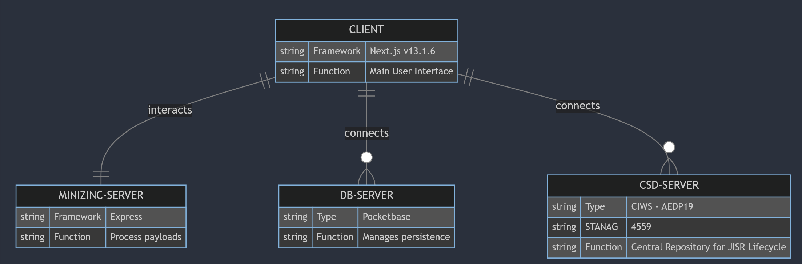

# MonoRepo for JAP

## Description
This repository contains the code necessary for running the JAP application and generating plan allocations.

## Getting Started

### Prerequisites
- Node.js LTS
- npm
- Minzinc (must add .exe to PATH)

### Installation
1. Clone this repository to your machine using `git clone`.
2. Navigate to the `client` folder and run `npm install`.
3. Navigate to the `MZNWebserver` folder and run `npm install`.
4. No installation needed for Pocketbase.

## Architecture

The JAP application is composed of three parts:
1. **The Client:** Written in Next.js (v13.1.6).
2. **The Minizinc Server:** A lightweight Express server with endpoints for processing payloads through MiniZinc engines.
3. **The Pocketbase Server:** An open-source backend in a single file that manages persistence for the application.



## Usage

## Important
1. Ensure that you set the path to your MiniZinc installation properly in the MZNWebserver/index.js file.
2. To enable requests to and from the MiniZinc server, CORS must be enabled in your browser. This can be achieved by installing a browser extension like “Allow CORS”.

## Development
### Environment Variables
No environment variables are required for this project.

### Setting Up the Development Environment
Run the following commands from the root of the directory:

```
cd client && npm run dev
cd MZNWebserver && node index.js
cd pocketbase && ./pocketbase serve
```